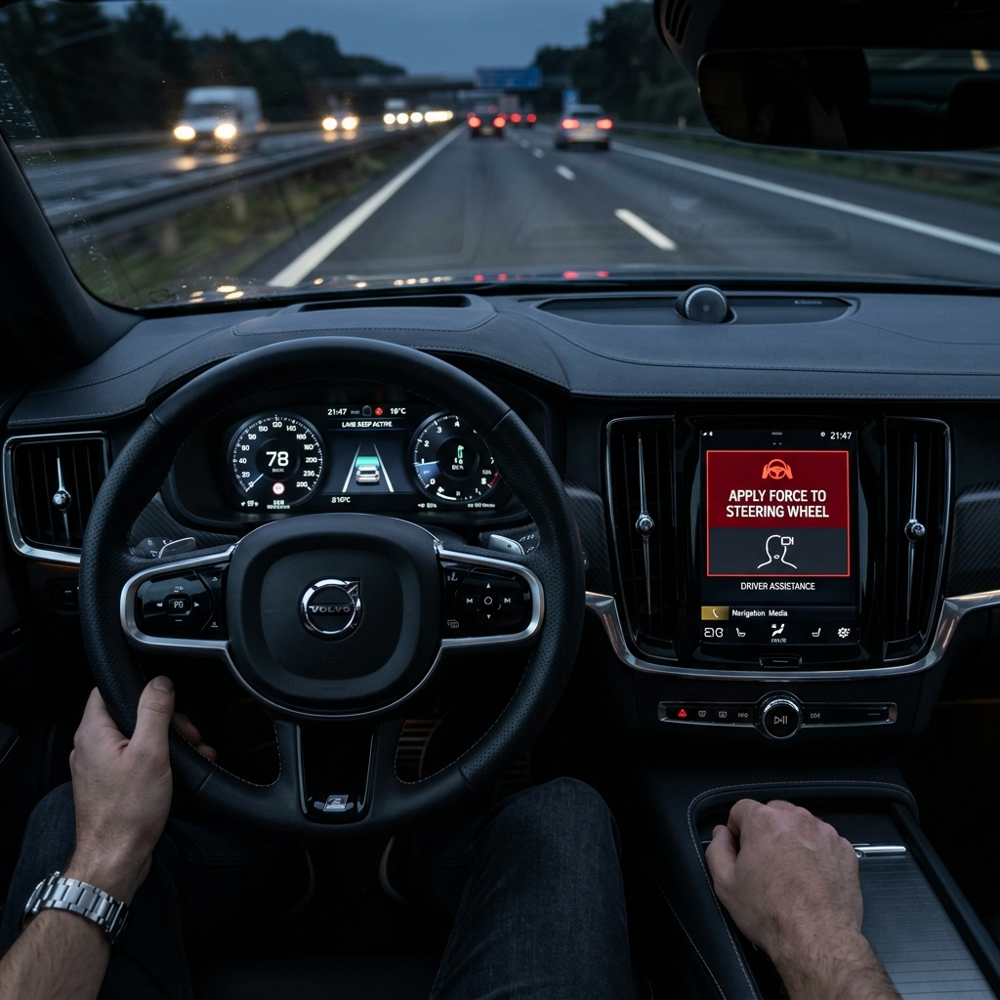
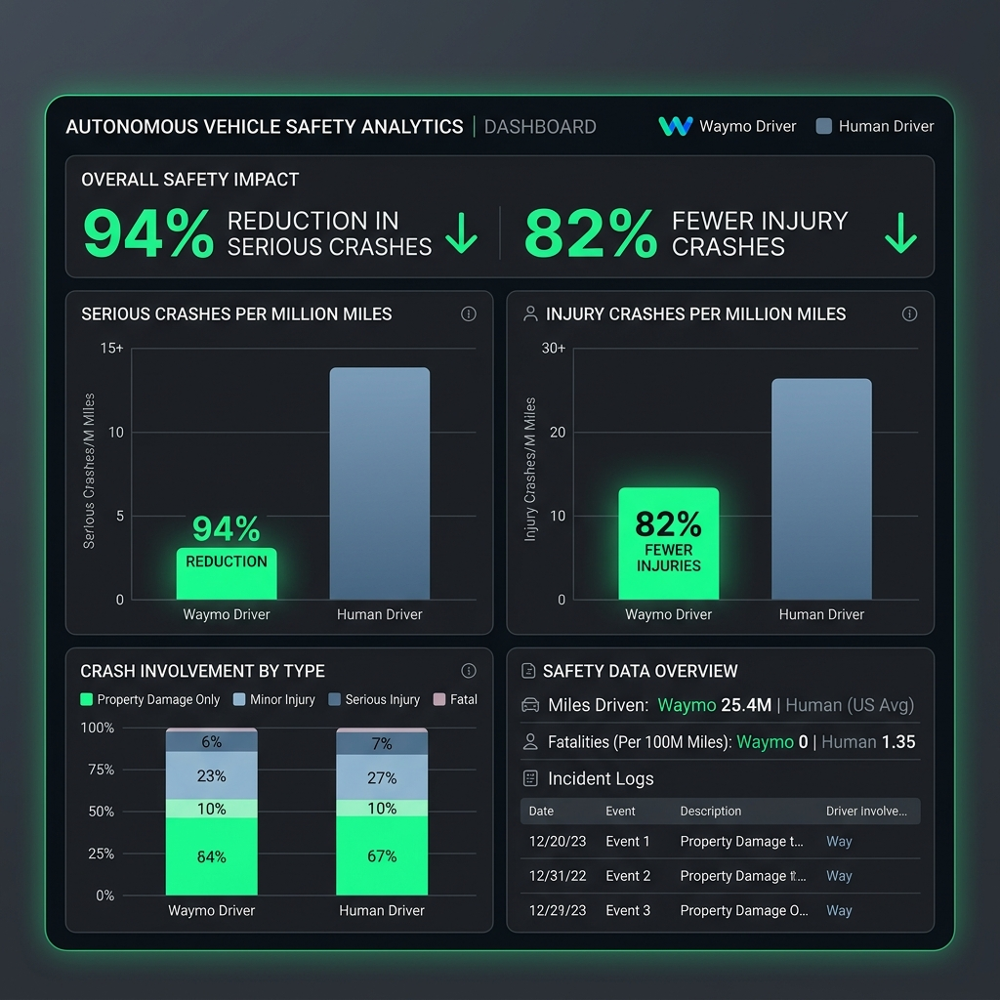

# Day24 Track 1 Lab — Case Study Hunt & Harm Map

**Ngành chọn:** Mobility / Autonomous Driving  
**Chủ đề:** Responsible AI, AI Ethics, AI Safety

---

## 1. Industry Risk Snapshot

| Câu hỏi                                         | Low / Medium / High / Critical | Vì sao?                                                                                                                                                |
| ----------------------------------------------- | -----------------------------: | ------------------------------------------------------------------------------------------------------------------------------------------------------ |
| Nếu AI sai, có thể gây hại thể chất không?      |                   **Critical** | Xe tự hành hoặc driver-assist sai có thể gây va chạm, thương tích hoặc tử vong.                                                                        |
| AI có ảnh hưởng đến quyết định hệ trọng không?  |                   **Critical** | AI trực tiếp hoặc gián tiếp ảnh hưởng đến phanh, đánh lái, giữ làn, phản ứng với người đi bộ, xe khác và vật cản.                                      |
| Hệ thống có động tới dữ liệu nhạy cảm không?    |                     **Medium** | Hệ thống có thể thu thập video đường phố, vị trí, hành vi lái xe và dữ liệu vận hành. Tuy nhiên rủi ro chính của ngành vẫn là an toàn vật lý.          |
| Nếu sai, hậu quả có khó đảo ngược không?        |                   **Critical** | Tai nạn giao thông, thương tích hoặc tử vong là hậu quả khó hoặc không thể đảo ngược.                                                                  |
| Nếu triển khai rộng, blast radius có lớn không? |                       **High** | Một lỗi phần mềm, lỗi thiết kế UX hoặc lỗi release criteria có thể ảnh hưởng hàng triệu xe hoặc nhiều thành phố.                                       |
| Có cần human review hoặc escalation không?      |                   **Critical** | Cần fail-safe, driver monitoring, remote assistance, incident review, recall/escalation và quy trình dừng triển khai khi vượt ngưỡng rủi ro.           |
| Risk profile tổng thể của ngành                 |                   **Critical** | AI trong mobility tác động trực tiếp đến an toàn con người trong môi trường đời thật, nhiều edge case và nhiều stakeholder ngoài người dùng trực tiếp. |

### Tóm tắt Risk Snapshot

Mobility / autonomous driving là ngành có risk profile **Critical** vì harm chính không chỉ là model sai, mà là hệ thống AI đi vào môi trường thật, tương tác với người đi bộ, hành khách, tài xế, xe khác và hạ tầng giao thông. AI safety trong ngành này cần trả lời: hệ thống ảnh hưởng đến ai, trong bối cảnh nào, có guardrails nào, có đủ bằng chứng để triển khai chưa, và ai chịu trách nhiệm khi có sự cố.

---

## 2. Shortlist case study thực tế

| Case                                                    |      Chọn? | Lý do                                                                                                                       |
| ------------------------------------------------------- | ---------: | --------------------------------------------------------------------------------------------------------------------------- |
| Uber ATG self-driving fatal crash, Tempe 2018           |     **Có** | Có báo cáo NTSB primary, có tử vong, có timeline kỹ thuật, phù hợp phân tích safety culture và escalation failure.          |
| Tesla Autopilot / Autosteer recall 2023                 |     **Có** | Có recall report NHTSA primary, số lượng xe lớn, phù hợp phân tích over-reliance, UX và blast radius.                       |
| Waymo Safety Impact report                              |     **Có** | Case tích cực về safety evidence, có số liệu so sánh với human benchmark, phù hợp phân tích evaluation và release criteria. |
| Cruise robotaxi dragging pedestrian, San Francisco 2023 | Không chọn | Case rất mạnh về incident reporting và regulator response, nhưng 3 case trên đã đủ cho bài cá nhân.                         |
| GM Cruise permit suspension 2023                        | Không chọn | Phù hợp nếu muốn đào sâu governance/regulator, nhưng trùng nhiều lens với case Uber và Tesla.                               |

---

# Case 1 — Uber ATG self-driving crash, Tempe 2018

## 3.1 Brief Case

| Field                    | Nội dung                                                                                                                                                                                                                                                                                                                                             |
| ------------------------ | ---------------------------------------------------------------------------------------------------------------------------------------------------------------------------------------------------------------------------------------------------------------------------------------------------------------------------------------------------- |
| Tên case                 | Uber ATG self-driving fatal crash                                                                                                                                                                                                                                                                                                                    |
| Ngành                    | Mobility / Autonomous Driving                                                                                                                                                                                                                                                                                                                        |
| Tổ chức / sản phẩm       | Uber Advanced Technologies Group, developmental automated driving system                                                                                                                                                                                                                                                                             |
| Use case AI              | Xe thử nghiệm tự hành chạy trên đường công cộng với safety operator ngồi sau vô-lăng để can thiệp khi cần.                                                                                                                                                                                                                                           |
| Thời điểm                | 18/03/2018; NTSB report adopted 19/11/2019                                                                                                                                                                                                                                                                                                           |
| Case xảy ra chuyện gì?   | Một xe thử nghiệm tự hành của Uber, dựa trên Volvo XC90 2017, đang chạy ở autonomous mode tại Tempe, Arizona thì đâm vào một người đi bộ 49 tuổi đang băng qua đường ngoài vạch qua đường. Người đi bộ tử vong tại hiện trường. NTSB nhấn mạnh vấn đề không chỉ là perception/model mà còn là safety culture và safety risk management của Uber ATG. |
| Stakeholder bị ảnh hưởng | Người đi bộ, safety operator, Uber ATG, cơ quan quản lý, cộng đồng tham gia giao thông.                                                                                                                                                                                                                                                              |
| Số liệu chính            | Xe chạy khoảng **19 phút** ở autonomous mode trước crash, tốc độ khoảng **45 mph**, hệ thống phát hiện người đi bộ khoảng **5.6 giây** trước va chạm; có **1 người tử vong**.                                                                                                                                                                        |
| Trích nguồn ngắn         | NTSB ghi nhận xe thử nghiệm tự hành của Uber đã đâm và gây tử vong cho một người đi bộ 49 tuổi; cuộc điều tra nhấn mạnh safety culture không đầy đủ của Uber ATG.                                                                                                                                                                                    |
| Nguồn 1                  | NTSB Highway Accident Report NTSB/HAR-19/03: <https://www.ntsb.gov/investigations/accidentreports/reports/har1903.pdf>                                                                                                                                                                                                                               |
| Nguồn 2                  | ETSC summary về kết luận NTSB: <https://etsc.eu/inadequate-safety-culture-contributed-to-fatal-uber-automated-test-vehicle-crash/>                                                                                                                                                                                                                   |
| Ghi chú độ tin cậy       | **Primary mạnh**: NTSB accident report. ETSC là nguồn secondary để đối chiếu.                                                                                                                                                                                                                                                                        |

> [!IMPORTANT]
> **Tài liệu dẫn chứng đi kèm:** [NTSB Highway Accident Report PDF](reference_materials/ntsb_uber_atg_report.pdf)

## 3.2 Harm Map Worksheet

| High-risk moment                                                        | Stakeholder bị ảnh hưởng | Failure mode                                    | Layer bắt đầu lỗi           | Harm xảy ra là gì?                                               | Harm lens               |     Severity |  Scale | Probability | Frequency | Vì sao?                                                                                                                                |
| ----------------------------------------------------------------------- | ------------------------ | ----------------------------------------------- | --------------------------- | ---------------------------------------------------------------- | ----------------------- | -----------: | -----: | ----------: | --------: | -------------------------------------------------------------------------------------------------------------------------------------- |
| Xe tự hành chạy ban đêm, gặp người đi bộ băng qua đường ngoài crosswalk | Người đi bộ              | Escalation failure / system reliability failure | Safety + System             | Xe không xử lý tình huống đủ an toàn, dẫn đến va chạm chết người | Injury                  | **Critical** | Medium |      Medium |       Low | Một incident gây tử vong là harm cực nặng. Scale không lớn vì là test fleet, nhưng context là public road nên rủi ro rất nghiêm trọng. |
| Safety operator không can thiệp kịp                                     | Người đi bộ, operator    | Over-reliance / monitoring failure              | UX + Operations             | Human fallback không hoạt động đúng vai trò bảo vệ an toàn       | Injury / Accountability | **Critical** | Medium |      Medium |    Medium | Khi thiết kế dựa vào “người giám sát” nhưng attention giảm, lớp human-in-the-loop có thể trở thành guardrail giả.                      |
| Tổ chức cho test trên public road khi safety risk management chưa đủ    | Cộng đồng giao thông     | Governance failure                              | Responsible AI / Governance | Đưa hệ thống chưa đủ kiểm chứng vào môi trường thật              | Public safety           | **Critical** |   High |      Medium |    Medium | NTSB nêu trọng tâm là safety culture và yêu cầu quản trị rủi ro khi test automated vehicles.                                           |

---

# Case 2 — Tesla Autopilot / Autosteer recall 2023

## 4.1 Brief Case

| Field                    | Nội dung                                                                                                                                                                                                                                                                                                                |
| ------------------------ | ----------------------------------------------------------------------------------------------------------------------------------------------------------------------------------------------------------------------------------------------------------------------------------------------------------------------- |
| Tên case                 | Tesla Autosteer recall 23V-838                                                                                                                                                                                                                                                                                          |
| Ngành                    | Mobility / Autonomous Driving                                                                                                                                                                                                                                                                                           |
| Tổ chức / sản phẩm       | Tesla Autopilot / Autosteer                                                                                                                                                                                                                                                                                             |
| Use case AI              | SAE Level 2 driver-assistance: hỗ trợ lái, giữ làn, điều chỉnh tốc độ, nhưng tài xế vẫn chịu trách nhiệm chính.                                                                                                                                                                                                         |
| Thời điểm                | Recall report ngày 12/12/2023                                                                                                                                                                                                                                                                                           |
| Case xảy ra chuyện gì?   | NHTSA và Tesla xử lý vấn đề driver misuse khi Autosteer được bật. Recall report nói trong một số tình huống, mức độ và phạm vi của các control có thể không đủ để ngăn tài xế misuse hệ thống SAE Level 2. Tesla triển khai OTA remedy để bổ sung controls và alerts nhằm nhắc tài xế duy trì trách nhiệm lái liên tục. |
| Stakeholder bị ảnh hưởng | Tài xế Tesla, hành khách, người đi đường, first responders, regulator.                                                                                                                                                                                                                                                  |
| Số liệu chính            | Recall ảnh hưởng **2,031,220** xe; defect estimate **100%** trong population được nêu trong Part 573 report.                                                                                                                                                                                                            |
| Trích nguồn ngắn         | Recall report ghi Autosteer là SAE Level 2, tài xế vẫn là operator và phải giữ tay trên vô-lăng, chú ý đường, can thiệp khi cần.                                                                                                                                                                                        |
| Nguồn 1                  | NHTSA Part 573 Safety Recall Report 23V-838: <https://static.nhtsa.gov/odi/rcl/2023/RCLRPT-23V838-8276.PDF>                                                                                                                                                                                                             |
| Nguồn 2                  | NHTSA chronology trong recall report: agency mở Preliminary Evaluation từ 2021, nâng lên Engineering Analysis năm 2022, rồi Tesla voluntary recall năm 2023.                                                                                                                                                            |
| Ghi chú độ tin cậy       | **Primary mạnh**: NHTSA recall report.                                                                                                                                                                                                                                                                                  |

> [!IMPORTANT]
> **Tài liệu dẫn chứng đi kèm:**
>
> - [NHTSA Recall 23V-838 Report PDF](reference_materials/tesla_recall_report.pdf)
> - [Hình ảnh cảnh báo HMI / Driver Monitoring](reference_materials/tesla_autopilot_warning.png)

## 4.2 Harm Map Worksheet

| High-risk moment                                     | Stakeholder bị ảnh hưởng           | Failure mode                          | Layer bắt đầu lỗi | Harm xảy ra là gì?                              | Harm lens              |     Severity |    Scale | Probability | Frequency | Vì sao?                                                                                               |
| ---------------------------------------------------- | ---------------------------------- | ------------------------------------- | ----------------- | ----------------------------------------------- | ---------------------- | -----------: | -------: | ----------: | --------: | ----------------------------------------------------------------------------------------------------- |
| Tài xế bật Autosteer nhưng hiểu nhầm mức tự động hóa | Tài xế, hành khách, người đi đường | Over-reliance                         | UX                | Tài xế giảm chú ý, không can thiệp kịp          | Injury                 | **Critical** | **High** |      Medium |    Medium | Sản phẩm ở quy mô rất lớn: hơn 2 triệu xe trong recall population.                                    |
| Hệ thống cảnh báo/kiểm soát tài xế chưa đủ mạnh      | Người đi đường, first responders   | Escalation failure                    | Safety            | Driver monitoring không đủ ngăn misuse          | Injury / Public safety |     **High** |     High |      Medium |    Medium | Recall report nói controls có thể không đủ để ngăn misuse trong một số tình huống.                    |
| OTA remedy sau khi xe đã triển khai rộng             | Regulator, người dùng, cộng đồng   | Governance / release criteria failure | Responsible AI    | Rủi ro được phát hiện và sửa sau deployment lớn | Accountability         |         High |     High |      Medium |       Low | Đây là ví dụ blast radius lớn: một thay đổi an toàn phải xử lý qua recall/OTA ở quy mô hàng triệu xe. |

---

# Case 3 — Waymo Safety Impact report

## 5.1 Brief Case

| Field                    | Nội dung                                                                                                                                                                                                                                     |
| ------------------------ | -------------------------------------------------------------------------------------------------------------------------------------------------------------------------------------------------------------------------------------------- |
| Tên case                 | Waymo Safety Impact evidence                                                                                                                                                                                                                 |
| Ngành                    | Mobility / Autonomous Driving                                                                                                                                                                                                                |
| Tổ chức / sản phẩm       | Waymo Driver / Waymo One                                                                                                                                                                                                                     |
| Use case AI              | Robotaxi tự hành, rider-only, vận hành trong các thành phố cụ thể.                                                                                                                                                                           |
| Thời điểm                | Safety Impact report và nghiên cứu 2025                                                                                                                                                                                                      |
| Case xảy ra chuyện gì?   | Đây là case tích cực: Waymo công bố dữ liệu so sánh crash rate của Waymo Driver với human benchmark trong cùng khu vực vận hành. Case này phù hợp để phân tích “release evidence”: khi nào có đủ bằng chứng để triển khai AI trong đời thật. |
| Stakeholder bị ảnh hưởng | Hành khách, người đi bộ, cyclist, motorcyclist, tài xế khác, thành phố, regulator.                                                                                                                                                           |
| Số liệu chính            | Waymo công bố **94% fewer serious injury or worse crashes**, **82% fewer airbag deployment crashes**, **82% fewer injury-causing crashes** so với human benchmark trong cùng operating cities.                                               |
| Trích nguồn ngắn         | Waymo báo cáo serious injury or worse crash rate all locations là **0.01 IPMM** với Waymo so với benchmark **0.23 IPMM**; any-injury-reported là **0.71 IPMM** so với benchmark **3.91 IPMM**.                                               |
| Nguồn 1                  | Waymo Safety Impact: <https://waymo.com/safety/impact/>                                                                                                                                                                                      |
| Nguồn 2                  | Paper 2025 phân tích **56.7 million rider-only miles** đến cuối tháng 1/2025: <https://arxiv.org/abs/2505.01515>                                                                                                                             |
| Ghi chú độ tin cậy       | Nguồn công ty + paper; cần đọc methodology vì dữ liệu do công ty cung cấp, nhưng có benchmark, outcome definition và statistical comparison rõ.                                                                                              |

> [!IMPORTANT]
> **Tài liệu dẫn chứng đi kèm:**
>
> - [Waymo Safety Analysis Paper PDF (arXiv:2505.01515)](reference_materials/waymo_safety_paper.pdf)
> - [Hình ảnh so sánh Waymo Driver vs Human Driver](reference_materials/waymo_safety_dashboard.png)

## 5.2 Harm Map Worksheet

| High-risk moment                                                             | Stakeholder bị ảnh hưởng   | Failure mode       | Layer bắt đầu lỗi       | Harm xảy ra là gì?                                                                                                 | Harm lens             |     Severity | Scale | Probability | Frequency | Vì sao?                                                                                                                           |
| ---------------------------------------------------------------------------- | -------------------------- | ------------------ | ----------------------- | ------------------------------------------------------------------------------------------------------------------ | --------------------- | -----------: | ----: | ----------: | --------: | --------------------------------------------------------------------------------------------------------------------------------- |
| Mở rộng robotaxi sang nhiều city/context mới                                 | Người đi đường, hành khách | Distribution shift | Model + Safety          | Hệ thống có thể an toàn ở city A nhưng fail ở city B, thời tiết khác, luật đường khác hoặc hành vi giao thông khác | Injury                | **Critical** |  High |      Medium |    Medium | Safety evidence cần gắn với operating domain; không nên dùng số liệu tổng quát để biện minh cho mọi môi trường.                   |
| Người dùng và public hiểu nhầm “an toàn hơn trung bình” là “không có rủi ro” | Hành khách, cộng đồng      | Over-trust         | UX + Communication      | Người dùng đặt niềm tin tuyệt đối, giảm chú ý đến limitation                                                       | Public safety / Trust |       Medium |  High |      Medium |    Medium | Safety report là bằng chứng tốt, nhưng không thay thế incident response, ODD limits và transparency.                              |
| Báo cáo safety dựa nhiều vào benchmark và reporting assumptions              | Regulator, public          | Measurement bias   | Governance + Evaluation | Đánh giá safety có thể bị hiểu sai nếu methodology không rõ                                                        | Accountability        |       Medium |  High |         Low |    Medium | Case này cho thấy Responsible AI cần công bố methodology, confidence interval, outcome definition, không chỉ headline percentage. |

---

## 6. Pattern rủi ro của ngành Mobility / Autonomous Driving

Risk pattern chính của ngành Mobility / Autonomous Driving là **physical safety + escalation + governance**. Khác với chatbot hoặc content AI, lỗi ở autonomous driving có thể chuyển rất nhanh từ “model nhận diện sai” sang “tai nạn thật”. Ba case cho thấy rủi ro thường không nằm ở model riêng lẻ mà ở **toàn bộ hệ thống**: perception, planning, driver monitoring, UX, ODD boundary, safety operator, recall process, incident response và văn hóa safety.

Trong case Uber, harm xảy ra khi hệ thống thử nghiệm trên đường công cộng không có safety risk management đủ mạnh và human fallback không can thiệp kịp. Trong case Tesla, harm pattern nổi bật là over-reliance: người dùng có thể hiểu nhầm hoặc misuse hệ thống Level 2, trong khi guardrail chưa đủ mạnh ở quy mô hơn 2 triệu xe. Trong case Waymo, rủi ro chính không chỉ là crash mà còn là câu hỏi về bằng chứng trước deployment: safety evidence phải gắn với operating domain, methodology và benchmark rõ ràng.

Nếu là team sản phẩm trong ngành này, ưu tiên sửa trước sẽ là:

1. **Chốt rõ ODD và release criteria**: chỉ launch khi có evidence theo từng city/context, không dùng số liệu tổng quát để biện minh cho mọi môi trường.
2. **Tăng guardrail cho escalation**: driver monitoring, minimum risk maneuver, remote assistance, emergency fallback.
3. **Thiết kế UX chống over-trust**: không dùng ngôn ngữ khiến người dùng tưởng Level 2 là tự lái hoàn toàn.
4. **Incident review bắt buộc**: mọi near-miss, disengagement, crash, user complaint phải feed vào safety evaluation.
5. **Public transparency**: công bố system limitation, crash taxonomy, benchmark methodology, confidence interval.

---

## 7. Bảng so sánh nhanh giữa các case trong cùng ngành

| Case                   | Harm dễ gặp nhất                                  | Failure mode hay lặp lại                      | Layer bắt đầu lỗi       |      Severity |  Scale | Risk profile |
| ---------------------- | ------------------------------------------------- | --------------------------------------------- | ----------------------- | ------------: | -----: | ------------ |
| Uber ATG crash         | Injury / death                                    | Escalation failure, safety culture failure    | Safety + Governance     |      Critical | Medium | Critical     |
| Tesla Autosteer recall | Injury do over-reliance                           | Over-reliance, misuse, weak driver monitoring | UX + Safety             |      Critical |   High | Critical     |
| Waymo Safety Impact    | Residual crash risk, over-trust, measurement risk | Distribution shift, measurement bias          | Evaluation + Governance | High/Critical |   High | High         |

---

## 8. Bảng so sánh các ngành — bản điền mẫu cho nhóm

| Ngành | Harm dễ gặp nhất | Failure mode hay lặp lại | Layer bắt đầu lỗi | Severity | Scale | Risk profile |
| ----- | ---------------- | ------------------------ | ----------------- | -------: | ----: | ------------ |

### Tổng hợp ngắn về risk profile giữa các ngành

---

## 9. Kết luận nộp bài

Ngành Mobility / Autonomous Driving có risk profile **Critical** vì AI được triển khai trong môi trường vật lý, nơi lỗi có thể gây thương tích hoặc tử vong. Các case cho thấy rủi ro không chỉ đến từ model perception/planning mà còn từ UX, driver monitoring, operating domain, escalation, safety culture và release governance.

Case Uber cho thấy hậu quả nghiêm trọng khi test public road thiếu safety management. Case Tesla cho thấy over-reliance và driver misuse có blast radius rất lớn khi sản phẩm đã triển khai hàng triệu xe. Case Waymo cho thấy hướng tích cực hơn là dùng safety evidence, benchmark và methodology rõ trước khi mở rộng deployment.

Bài học quan trọng nhất là: **AI safety không thể chỉ kiểm tra accuracy của model. Cần đánh giá toàn bộ hệ thống trong bối cảnh đời thật, với stakeholder thật, harm thật, guardrail thật và người chịu trách nhiệm rõ ràng.**

---

## 10. Danh mục tài liệu và dẫn chứng (Reference Materials)

Thư mục [reference_materials](reference_materials/) lưu trữ các tài liệu chính thức và các hình ảnh mô phỏng trực quan được sử dụng để đối chiếu, kiểm chứng thông tin trong bài báo cáo:

| Tên tệp tin                                                                    | Loại tệp | Ý nghĩa & Vai trò                                                                                                                                                              |
| :----------------------------------------------------------------------------- | :------: | :----------------------------------------------------------------------------------------------------------------------------------------------------------------------------- |
| [ntsb_uber_atg_report.pdf](reference_materials/ntsb_uber_atg_report.pdf)       |   PDF    | Báo cáo chi tiết vụ tai nạn Uber ATG năm 2018 của Ủy ban An toàn Giao thông Quốc gia Mỹ (NTSB) - làm bằng chứng sơ cấp cho lỗi Safety Culture và cơ chế Escalation.            |
| [tesla_recall_report.pdf](reference_materials/tesla_recall_report.pdf)         |   PDF    | Báo cáo thu hồi xe số hiệu 23V-838 của NHTSA dành cho Tesla Autopilot - làm bằng chứng sơ cấp về rủi ro Over-reliance và vấn đề Driver Monitoring.                             |
| [tesla_autopilot_warning.png](reference_materials/tesla_autopilot_warning.png) |   PNG    | Hình ảnh trực quan mô phỏng cảnh báo HMI "APPLY FORCE TO STEERING WHEEL" trên buồng lái Tesla để minh họa sinh động cho phần tương tác người-máy (UX).                         |
| [waymo_safety_paper.pdf](reference_materials/waymo_safety_paper.pdf)           |   PDF    | Toàn văn nghiên cứu khoa học arXiv:2505.01515 so sánh tỉ lệ tai nạn của Waymo với tài xế con người ở quy mô 56.7 triệu dặm - cung cấp dữ liệu thực nghiệm về Release Criteria. |
| [waymo_safety_dashboard.png](reference_materials/waymo_safety_dashboard.png)   |   PNG    | Biểu đồ trực quan so sánh tỷ lệ tai nạn (giảm 94% tai nạn nghiêm trọng, 82% tai nạn chấn thương) giữa Waymo Driver và con người để làm hình ảnh minh họa trực quan.            |
